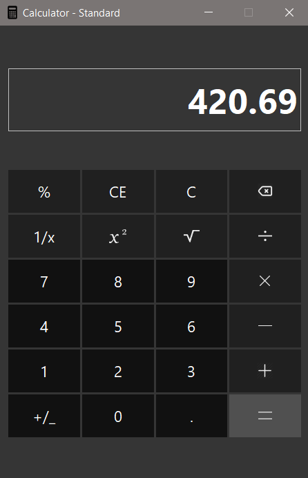

# SCIENTIFIC CALCULATOR

UI overhaul of Scientific calculator previously done by [Patrick Attankurugu](https://github.com/PatrickAttankurugu/Scientific-Calculator)
using PyQt5.

## Screenshot
*Work in progress*

