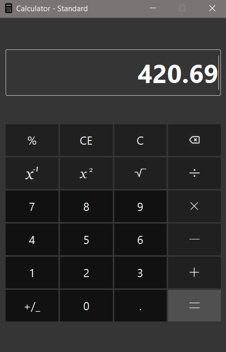

# SCIENTIFIC CALCULATOR

>UI overhaul of Scientific calculator using PyQt5.
> 
>Inspired by [Patrick Attankurugu](https://github.com/PatrickAttankurugu/Scientific-Calculator).

## Screenshot
>*Work in progress*

